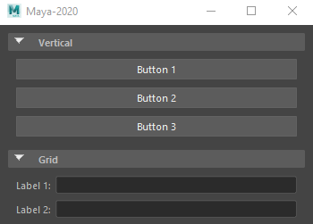

# Python Qt Collapsable Frame Widget

## Source Project

*A Qt collapsable widget in Python, in the spirit of the Autodesk Maya 'frameLayout' command.*

This project is based on [PyQt Collapsable Widget](https://github.com/By0ute/pyqt-collapsible-widget) from [Caroline Beyne](https://github.com/By0ute).


## Examples

Here are 2 examples of the Collapsable Frame in action.
The first one is in a standard Python application, the second one is inside a Maya 2020 session.

 


## Changes

Some changes have been made to the original project to allow more flexibility.


### Frame Content

The content of the collapsable frame widget can be any QWidget or derived class.
This allows to have any content instead of being limited to a VBox layout.

To set the content, simply create a QWidget with its content, and set it as content to the collapsable frame widget:
```python
# Create a QWidget
some_widget = QWidget()

# Set widget layout and content
# ...

# Create the collapsable frame widget and set its content
frame = CollapsableFrame(title="Collapsable Frame")
frame.setContent(some_widget)
```


### Qt.py

*Qt.py enables you to write software that runs on any of the 4 supported bindings - PySide2, PyQt5, PySide and PyQt4.*

Use of [Qt.py](https://github.com/mottosso/Qt.py) from [Marcus Ottosson](https://github.com/mottosso), allowing to use any Qt Python binding instead of only PyQt4.

The Qt.py file must be located in one of the defined Python paths.
The provided version of Qt.py can be used.


### Style

Use current palette colours instead of hardcoded ones, in order to follow the customisation of the style*.

Additionnal changes were made to the widget style to have it even closer to the Maya 'frameLayout' component.

*More should be done in order to follow changes in sizes and font style.


### Refactoring

Parts of the code have been modified or replaced in order to handle the new changes, as well as to fix some minor issues.


## Files

* **collapsable_frame.py**: The core of the project, containing the class definition of the Collapsable Frame
* [extras]
    * **Qt.py**: The Qt.py file allowing to use the different Qt Python bindings
    * **usage.py**: An example file showing how to use the Collapsable Frame


## Remarks

### Qt.py doesn't replace Qt
Qt and one of the Python bindings need to be installed on the system, and accessible from the Python session.

In Maya: Qt and its PySide bindings are included in the installation, hence don't need to be installed separately.

### Python version
The project was written in Python 2.7 (as used by Maya 2020), but should work with any version of Python post 2.7.
The standalone code (outside of Maya) has been tested in Python 2.7.16 and 3.7.9.

### Known bugs/issues

* *TitleFrame* colour:<br>
The background colour of the TitleFrame is set to the colour of a button (QPalette.Button).<br>
However, the obtained colour seems to be the same as the window background colour (QPalette.Window).
This problem seems to happen only in a Python standalone application (not inside a Maya session).
To counter this issue, if the colours from the window background and the button are the same, a border is added around the TitleFrame.<br>
This is definitely not ideal, but is a temporary "fix".

If any other bugs are encountered, please let me know by either opening an issue or contacting me directly.